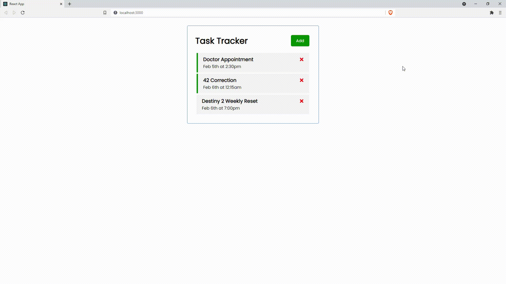

<div id="top"></div>
<!--
*** Amazing README template from othneildrew
*** https://github.com/othneildrew/Best-README-Template
-->


<!-- PROJECT LOGO -->
<br />
<div align="center">
  <h1>Task Manager in React</h1>
  
</div>

<!-- ABOUT THE PROJECT -->
## ℹ️ About The Project

A really basic task manager page without data persistance, quick project made to start getting acquainted with react.

### Built With

* [React.js](https://reactjs.org/)

<p align="right">(<a href="#top">back to top</a>)</p>


<!-- GETTING STARTED -->
## 🏃 Quick Start

* Clone the repo
  ```sh
  git clone https://github.com/its-a-maxi/task-manager-react.git
  ```
  
<p align="right">(<a href="#top">back to top</a>)</p>


<!-- USAGE EXAMPLES -->
## ⌨️ Usage

* Run task-manager.sh
```sh
  ./task-manager.sh
```

<p align="right">(<a href="#top">back to top</a>)</p>


<!-- CONTACT -->
## 📫 Contact

Maximo Monroy - monroy.vds@gmail.com

Project Link: [https://github.com/its-a-maxi/task-manager-react](https://github.com/its-a-maxi/task-manager-react)

<p align="right">(<a href="#top">back to top</a>)</p>


<!-- ACKNOWLEDGMENTS -->
## 🥇 Acknowledgments

Thanks to _Traversy Media_ tutorials, amazing explanations and presentations.
* [React JS Crash Course 2021](https://www.youtube.com/watch?v=w7ejDZ8SWv8&list=LL&index=1&t=4583s)

<p align="right">(<a href="#top">back to top</a>)</p>


<!-- MARKDOWN LINKS & IMAGES -->
<!-- https://www.markdownguide.org/basic-syntax/#reference-style-links -->
[contributors-shield]: https://img.shields.io/github/contributors/othneildrew/Best-README-Template.svg?style=for-the-badge
[contributors-url]: https://github.com/othneildrew/Best-README-Template/graphs/contributors
[forks-shield]: https://img.shields.io/github/forks/othneildrew/Best-README-Template.svg?style=for-the-badge
[forks-url]: https://github.com/othneildrew/Best-README-Template/network/members
[stars-shield]: https://img.shields.io/github/stars/othneildrew/Best-README-Template.svg?style=for-the-badge
[stars-url]: https://github.com/othneildrew/Best-README-Template/stargazers
[issues-shield]: https://img.shields.io/github/issues/othneildrew/Best-README-Template.svg?style=for-the-badge
[issues-url]: https://github.com/othneildrew/Best-README-Template/issues
[license-shield]: https://img.shields.io/github/license/othneildrew/Best-README-Template.svg?style=for-the-badge
[license-url]: https://github.com/othneildrew/Best-README-Template/blob/master/LICENSE.txt
[linkedin-shield]: https://img.shields.io/badge/-LinkedIn-black.svg?style=for-the-badge&logo=linkedin&colorB=555
[linkedin-url]: https://linkedin.com/in/othneildrew
[product-screenshot]: images/screenshot.png
